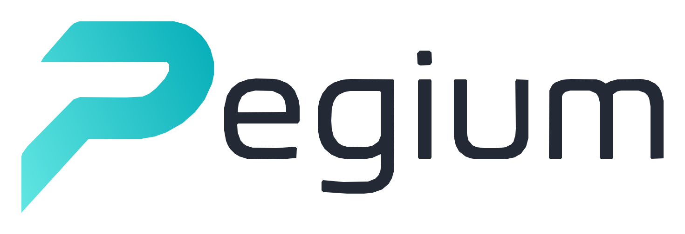

<div align="center">
  <picture>
    <source media="(prefers-color-scheme: dark)" srcset="docs/assets/logo-dark.svg">
    
  </picture>
  <h3>C++20 language engineering toolkit</h3>
</div>

<div align="center">

  [](https://github.com/ydaveluy/pegium/actions/workflows/ci.yml)
  [](https://github.com/ydaveluy/pegium/actions/workflows/docs.yml)
  [](https://github.com/ydaveluy/pegium/actions/workflows/sonarcloud.yml)
  [](https://sonarcloud.io/summary/new_code?id=ydaveluy_pegium)

</div>

---

Pegium is a language engineering toolkit for C++20 with built-in support for
parsing, AST/CST construction, references, validation, formatting, and
language-server features.

Pegium is strongly inspired by
[Langium](https://github.com/eclipse-langium/langium), and many of the core
concepts are intentionally similar. The main difference is that Pegium centers
on a PEG-based parser DSL in C++, instead of Langium's TypeScript grammar and
parser stack.

* **Semantics First:** Pegium lets you shape the semantic model of your
  language directly through C++ AST types plus grammar assignments, while still
  keeping CST data available for source-aware tooling.
* **Explicit Services, Customizable by Design:** Pegium exposes parser,
  scoping, validation, workspace, formatting, and LSP behavior through visible
  service objects instead of hiding the wiring behind heavy code generation.
* **Parser to Editor in One Toolkit:** The same document model supports parsing,
  linking, diagnostics, formatting, completion, rename, references, and other
  editor features.

## Installation

**Prerequisites:** a C++20 compiler, CMake 3.14 or later. Node.js is only
needed if you want to build the VS Code extension (`-DVSCODE=ON`, the default).

Scaffold a new language with a single command — no cloning required:

```bash
curl -fsSLO https://ydaveluy.github.io/pegium/pegium-new.cmake && \
  cmake -DNAME=MyLang -DEXT=.ml -P pegium-new.cmake
cd mylang && cmake -B build && cmake --build build -j
./build/mylang-cli example/hello.ml
```

The script creates a `mylang/` directory with a working "Hello world" grammar,
CLI, LSP server, and VS Code extension, pulling Pegium in via `FetchContent`.

### Scaffolding flags

| Flag | Default | Description |
|------|---------|-------------|
| `NAME` | *(required)* | PascalCase C++ identifier for your language (e.g. `MyLang`) |
| `EXT` | `.<lowercased-name>` | File extension, must start with `.` (e.g. `-DEXT=.ml`) |
| `DIR` | `<lowercased-name>` | Output directory (e.g. `-DDIR=my-project`) |
| `LSP` | `ON` | Build the LSP server; pass `-DLSP=OFF` to skip |
| `VSCODE` | `ON` | Scaffold the VS Code extension; pass `-DVSCODE=OFF` to skip |
| `CLI` | `ON` | Build the CLI tool; pass `-DCLI=OFF` to skip |
| `PEGIUM_TAG` | `main` | Pegium tag/commit to pin (e.g. `-DPEGIUM_TAG=v1.2.0`) |

### Add Pegium to an existing CMake project

Pegium is consumed via CMake **FetchContent** (or `add_subdirectory`). As of
v0.1.0 it intentionally ships **no `install()` rules and no `find_package(pegium)`
config** — pin a tag and pull it into your build:

```cmake
include(FetchContent)
FetchContent_Declare(
  pegium
  GIT_REPOSITORY https://github.com/ydaveluy/pegium.git
  GIT_TAG v0.1.0
)
FetchContent_MakeAvailable(pegium)

target_link_libraries(my_language PUBLIC pegium::core)
```

Available targets: `pegium::core` (parser, workspace, references), `pegium::lsp`
(language server), `pegium::cli` (CLI/test helpers), `pegium::converters`.
Requires a C++20 compiler.

### Try the shipped examples

Open the repository root in VS Code, go to `Run and Debug`, pick one of
`Run Arithmetics Extension`, `Run DomainModel Extension`,
`Run Requirements Extension`, or `Run Statemachine Extension`, then press
`F5`.

On the first launch, VS Code runs the matching `Prepare ... Extension` task for
you: it configures CMake, builds the example language server, installs the
extension dependencies if needed, and compiles the VS Code extension.

VS Code then opens a new Extension Development Host window on the corresponding
example workspace, so you can immediately try the language features on the
shipped sample files.

If you are new to the project, the best documentation entry points are:

- [Introduction](https://ydaveluy.github.io/pegium/introduction/)
- [Learn Pegium](https://ydaveluy.github.io/pegium/learn/)
- [Recipes](https://ydaveluy.github.io/pegium/recipes/)
- [Reference](https://ydaveluy.github.io/pegium/reference/)
- [Examples Overview](https://ydaveluy.github.io/pegium/examples/)

## Documentation

You can find the Pegium documentation on
[the documentation website](https://ydaveluy.github.io/pegium/).

The documentation is organized into several sections:

- [Introduction](https://ydaveluy.github.io/pegium/introduction/): what Pegium
  is, why it exists, and how it relates to Langium
- [Learn](https://ydaveluy.github.io/pegium/learn/): the recommended workflow
  for building a language with Pegium
- [Recipes](https://ydaveluy.github.io/pegium/recipes/): targeted guides for
  customization tasks such as scoping, validation, caching, and multiple
  languages
- [Reference](https://ydaveluy.github.io/pegium/reference/): canonical
  documentation for grammar, services, semantic model, and document lifecycle
- [Examples](https://ydaveluy.github.io/pegium/examples/): the shipped example
  languages and what each one demonstrates

The documentation sources live in [docs/](docs/index.md) in this repository.

## Examples

Pegium ships several end-to-end examples in this repository:

- **[arithmetics](examples/arithmetics/README.md)**: a compact expression
  language with evaluator, formatter, CLI, and LSP server
- **[DomainModel](examples/domainmodel/README.md)**: a modeling DSL with
  qualified names, formatter rules, and rename support
- **[requirements](examples/requirements/README.md)**: a multi-language example
  showing shared workspace behavior and cross-language references
- **[statemachine](examples/statemachine/README.md)**: a modeling language that
  emphasizes validation and editor integration

## Benchmarks

Pegium and [Langium](https://github.com/eclipse-langium/langium) ship the same
four example languages, so they can be compared directly. Each language is built
through the full document pipeline (parse → index → scope → link → validate) from
**byte-identical** generated inputs, averaged over 3 iterations. The workspace
benchmarks hand many self-contained files of one language to the framework's
document builder **at once**, as a single small (~250 KB) and large (~12 MB)
startup build — Pegium parallelizes those builds across all cores.

Each table reports the full build time and the throughput (MiB/s) for both
engines, plus the Langium-over-Pegium speedup; the workspace tables also report
the peak resident memory (RSS) of each build. Lower time / higher throughput /
lower memory is better. RSS includes each runtime's baseline — Node/V8 carries a
fixed multi-tens-of-MiB heap Pegium's native process does not — so read it
alongside how it grows with input size. Langium 4.3.0 / Node.js 26.

Single-file full build (64 KiB):

| language | pegium time | pegium throughput | langium time | langium throughput | speedup |
| --- | ---: | ---: | ---: | ---: | ---: |
| arithmetics | 2.83 ms | 22.1 MiB/s | 276 ms | 0.2 MiB/s | ~98× |
| domainmodel | 0.95 ms | 65.8 MiB/s | 153 ms | 0.4 MiB/s | ~161× |
| requirements | 0.93 ms | 67.3 MiB/s | 39 ms | 1.6 MiB/s | ~42× |
| statemachine | 1.24 ms | 50.4 MiB/s | 80 ms | 0.8 MiB/s | ~64× |

Workspace full build, ~250 KB (all files built simultaneously at startup):

| language | pegium time | pegium throughput | langium time | langium throughput | speedup | pegium RSS | langium RSS | RSS ratio |
| --- | ---: | ---: | ---: | ---: | ---: | ---: | ---: | ---: |
| arithmetics | 1.69 ms | 148.1 MiB/s | 498 ms | 0.5 MiB/s | ~295× | 18 MiB | 211 MiB | ~12× |
| domainmodel | 1.20 ms | 208.9 MiB/s | 232 ms | 1.1 MiB/s | ~193× | 18 MiB | 186 MiB | ~10× |
| requirements | 3.03 ms | 82.8 MiB/s | 134 ms | 1.9 MiB/s | ~44× | 18 MiB | 174 MiB | ~10× |
| statemachine | 1.34 ms | 189.2 MiB/s | 212 ms | 1.2 MiB/s | ~158× | 18 MiB | 187 MiB | ~10× |

Workspace full build, ~12 MB (all files built simultaneously at startup):

| language | pegium time | pegium throughput | langium time | langium throughput | speedup | pegium RSS | langium RSS | RSS ratio |
| --- | ---: | ---: | ---: | ---: | ---: | ---: | ---: | ---: |
| arithmetics | 43 ms | 278.9 MiB/s | 23.8 s | 0.5 MiB/s | ~553× | 615 MiB | 3.1 GiB | ~5× |
| domainmodel | 30 ms | 401.2 MiB/s | 10.1 s | 1.2 MiB/s | ~338× | 365 MiB | 2.1 GiB | ~6× |
| requirements | 98 ms | 122.5 MiB/s | 51.6 s | 0.2 MiB/s | ~527× | 338 MiB | 1.6 GiB | ~5× |
| statemachine | 30 ms | 397.1 MiB/s | 10.1 s | 1.2 MiB/s | ~336× | 404 MiB | 2.2 GiB | ~6× |

Numbers are indicative and hardware-dependent; reproduce them on your own machine
with:

```bash
cmake --build build -j --target PegiumBench
# Uses a sibling ../langium checkout; pass --setup to clone + build the latest
# Langium and install the bench harness automatically.
python3 tools/compare_langium_bench.py --setup
```

`PegiumBench` (under [`tests/bench/`](tests/bench/)) and the Langium harness
([`tools/langium-bench/bench-examples.mjs`](tools/langium-bench/bench-examples.mjs))
generate the same inputs and report the same format, which
[`tools/compare_langium_bench.py`](tools/compare_langium_bench.py) diffs into the
tables above.

## License

Pegium is [MIT licensed](LICENSE) (c) 2024-2026 Yannick Daveluy.
